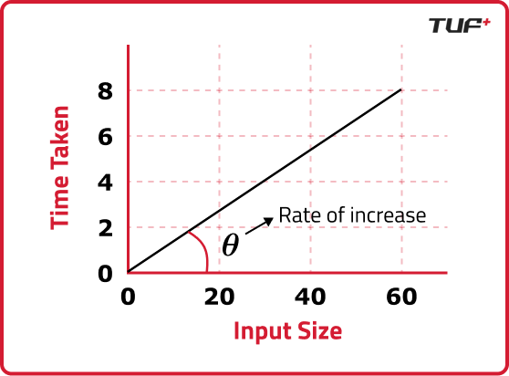

# Understanding Time and Space Complexity

(Refer offline Notes as well)

In software engineering, every algorithm possesses a certain level of complexity, which is crucial in determining its efficiency. Complexity is typically measured in two ways:

## `Time Complexity:`

The amount of time an algorithm takes to complete as a function of the input size. It provides a way to quantify the efficiency of an algorithm by expressing how the execution time grows as the input size increases.

As the size of the input increases, the time taken by the program to execute also increases. This relationship between input size and execution time is fundamental in understanding time complexity.

- `Rate of Change and Time Complexity` : The rate of change in the execution time as the input size increases can be expressed as:

(input2 - input1) / (time2 - time1)

This rate of change is what defines the time complexity of an algorithm. Time complexity is often measured using Big O notation, which provides an upper bound on the time taken as a function of the input size.

- `Rules for Solving Time Complexity` :
  - `Avoid Constants`: When calculating time complexity, constant factors are ignored. For example, in the loop mentioned above, O(5) is simplified to O(1) since the constant does not change with the input size. The focus is on how the algorithm scales, not on fixed numbers.
  - `Consider the Worst Case`: Time complexity analysis typically considers the worst-case scenario, as this provides a guarantee on the maximum time an algorithm will take. For instance, in searching algorithms, the worst case occurs when the desired element is at the last position or not present at all.

## `Space Complexity:`

The amount of memory an algorithm uses as a function of the input size. It accounts for the total amount of space required by the algorithm, including the space used by variables, data structures, and function call stacks.

Space complexity measures the amount of memory an algorithm requires as a function of the input size. It is a critical aspect of algorithm efficiency, especially in memory-constrained environments. Space complexity can be broken down into two main components:

Auxiliary Space: This refers to the extra space or temporary space used by the algorithm, apart from the input data. It includes variables, data structures, and function call stacks that the algorithm utilizes during execution.

Input Space: This is the memory occupied by the input data itself. In many cases, the input space is considered negligible when analyzing space complexity, as it is independent of the algorithm's operations.

Examples of Space Complexity:

Array of Size N: Consider an array with N elements. The space complexity in this case is O(N), as the memory required scales linearly with the number of elements in the array.

Recursive Function: For a recursive algorithm, the space complexity is determined by the call stack, which grows with the depth of the recursion. For a recursive function that calls itself N times, the space complexity is O(N).

## `End Notes`

Understanding both time and space complexity is essential for writing optimized code, as it helps in choosing the most efficient algorithm for a given problem. Efficient algorithms not only reduce the time taken to execute but also minimize the resources required, which is especially important in large-scale applications and systems with limited resources.
